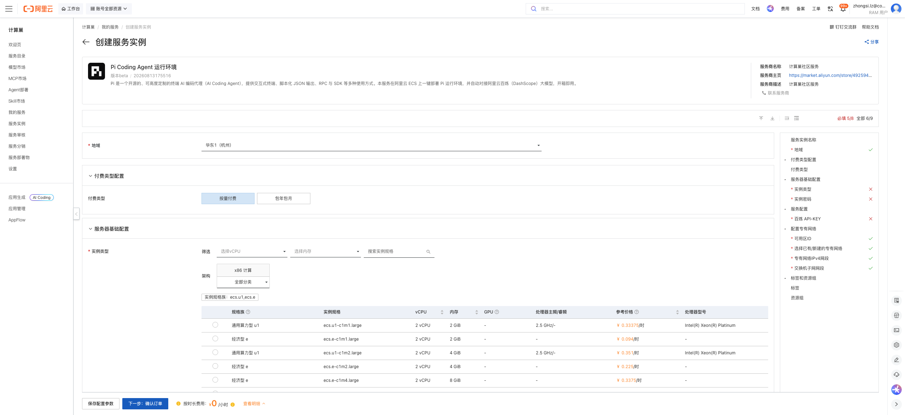
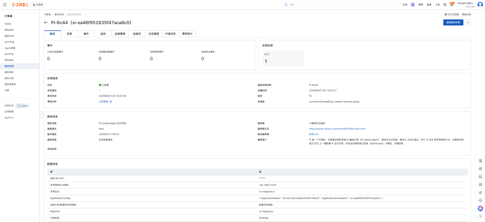
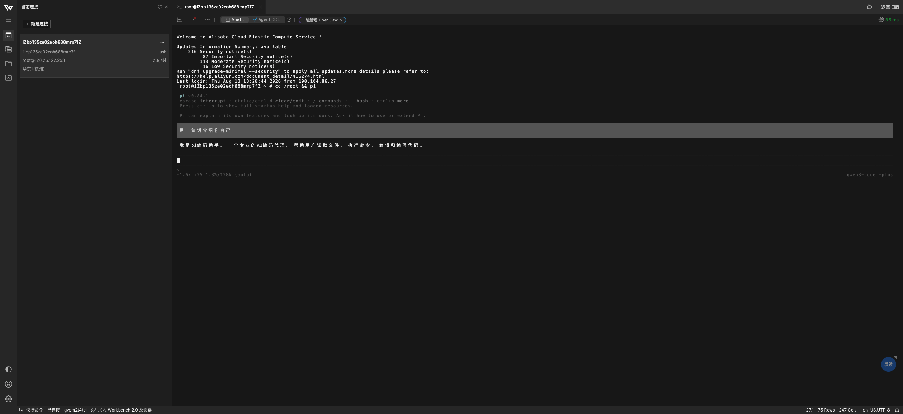

# Pi Coding Agent 运行环境 部署文档

## 概述

Pi Coding Agent 运行环境 是一款开源的、可高度定制的终端 AI 编码代理运行环境，支持交互式终端、脚本化 JSON 输出、RPC 与 SDK 等多种使用方式，并自动对接阿里云百炼（DashScope）大模型。通过阿里云计算巢服务，您可以快速部署 Pi Coding Agent 运行环境，实现开箱即用。

## 部署流程

### 1. 创建服务实例

访问 Pi Coding Agent 运行环境 服务部署链接，按提示填写部署参数：

[部署链接](https://computenest.console.aliyun.com/service/instance/create/cn-hangzhou?type=user&ServiceId=service-9a72aed6c4f240149e22)

### 2. 确认订单并创建

参数填写完成后可以看到对应询价明细，确认参数后点击 **下一步：确认订单**。确认订单完成后同意服务协议并点击 **立即创建** 进入部署阶段。

### 3. 等待部署完成

等待部署完成后进入服务实例管理，在控制台找到 Pi Coding Agent 运行环境 所创建的 ECS 服务器。

### 4. 访问服务

远程连接该 ECS 服务器，执行 `sudo su root` 后运行 `pi` 即可使用服务。

## 官方文档

更多信息请访问官方文档：[Pi 官方文档](https://pi.dev/)
